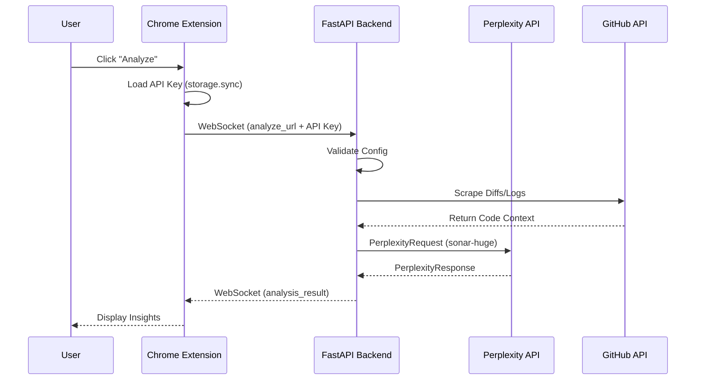
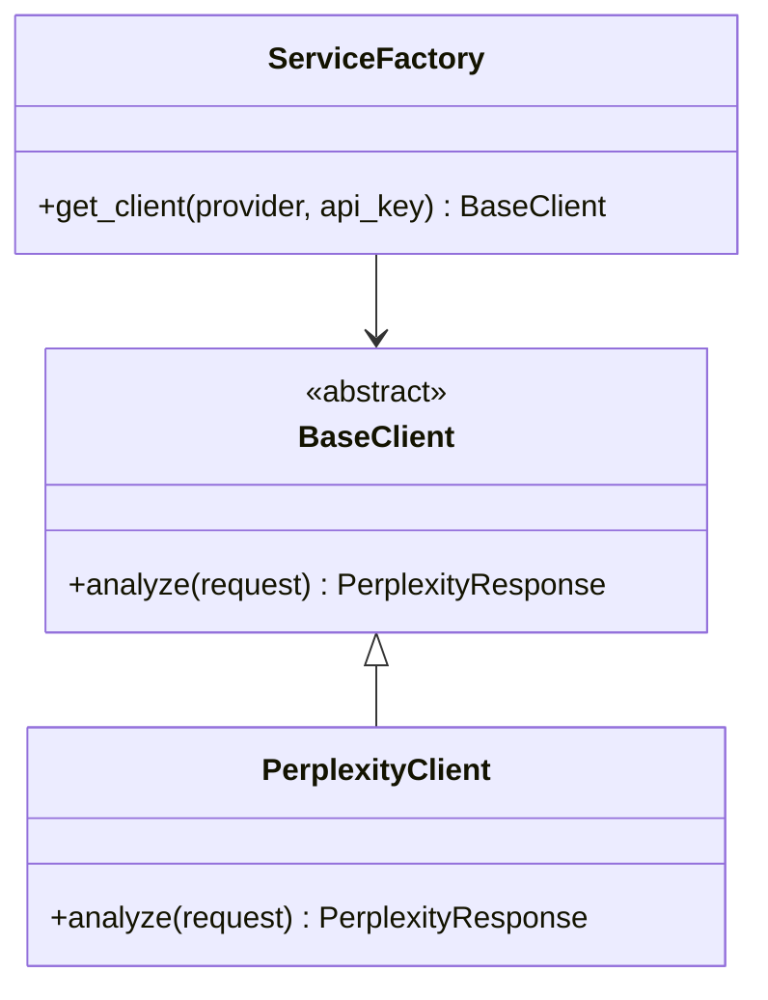

# Architecture Overview: CodeReview Agent

This document describes the technical architecture and data flow of the CodeReview Agent.

## System Architecture

The CodeReview Agent consists of three main components:
1. **Chrome Extension**: The user interface for triggering analysis and viewing results.
2. **FastAPI Backend**: The orchestrator that handles logic, API coordination, and data processing.
3. **AI Services**: External providers like Perplexity API that perform specialized analysis.

### Request Flow

## Backend Components

### ServiceFactory & AI Clients

The backend is designed for multi-provider support through a factory pattern.

- **BaseClient**: Ensures all AI clients implement the same `analyze` method.
- **ServiceFactory**: Decouples client creation from endpoint logic, allowing dynamic API key injection.

### Data Models

- **PerplexityRequest**: Contains the user query and optional context.
- **PerplexityResponse**: Contains the AI's answer and metadata (sources, model used).

## WebSocket Communication

Messages exchanged between the extension and backend are JSON-encoded:

| Type | Direction | Payload |
|------|-----------|---------|
| `analyze_url` | Ext -> BE | `url`, `api_key` |
| `analysis_result` | BE -> Ext | `answer`, `metadata` |
| `error` | BE -> Ext | `message` |

## Extension Security

- **API Key Scoping**: Keys are stored using `chrome.storage.sync` (encrypted by Chrome).
- **In-Memory Usage**: Keys are passed to the backend per-request via the WebSocket channel, ensuring the backend itself doesn't need to persist user-specific keys.
