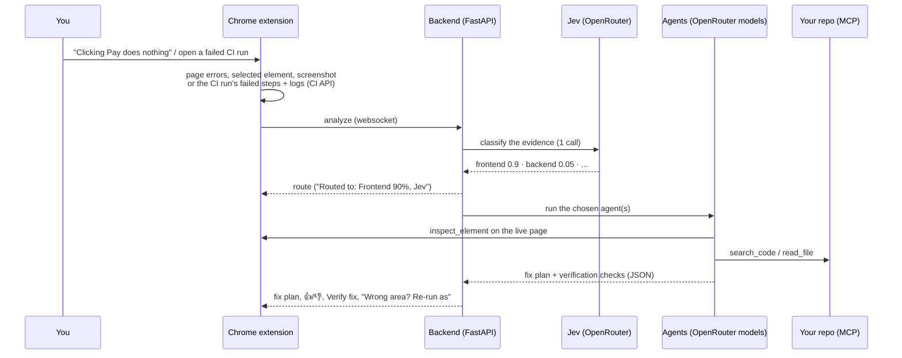

# 🤖 CodeReview Agent

[](https://fastapi.tiangolo.com/)
[](https://openrouter.ai/)
[](https://modelcontextprotocol.io/)
[](https://developer.chrome.com/docs/extensions)

> **Tell it what's broken - on a web page or in a failed CI run - and it routes the problem to the right agent,
> reads your code, writes a fix plan, verifies the fix in your browser and learns from your 👍/👎.**
> One OpenRouter key; no Anthropic subscription or other browser agent needed.

---

## ✨ Key Features

- 🧭 **Routed to the right agent**: every problem is first classified - frontend, backend, CI or config/environment -
  by [Jev](https://typesafe.ai/blog/introducing-system-one-models-and-jev), a model that returns calibrated
  probabilities instead of text, through OpenRouter with the same key. The side panel shows the decision
  ("Routed to: Backend 92%") and lets you re-run with another agent. See [Routing](#-routing).
- 🔒 **Sensitive data stays on the trusted model**: problems from projects you mark sensitive, or whose evidence
  holds secrets or personal data, or that Jev flags, run on `openai/gpt-5.4` with no-data-collection providers; the
  rest run on the cheaper, faster `openai/gpt-5.4-mini`. Secrets are redacted before classification. See
  [Sensitive data](#-sensitive-data).
- 🪜 **Escalates when unsure**: if an agent's answer is unusable, low-confidence, or never cites your code, it's re-run
  once on the stronger `openai/gpt-5.4` - decided by rules, not by another model call.
- 📸 **Sees what you see**: screenshots are captured natively from your logged-in tab
  (`chrome.tabs.captureVisibleTab`) and analyzed by a vision model - only when the problem is visual.
- 🔎 **Live page inspection**: agents call `inspect_element` on your open tab through the extension (computed
  styles, hidden/covered state, size, attributes) and read the page's console and failed-network errors (DevTools).
- 🛠️ **Reads your code through MCP**: a sandboxed MCP server (`src/repo_tools`) gives the agents
  `list_files` / `read_file` / `search_code` on your local checkout, in a bounded tool-calling loop.
- 🏭 **CI on Azure DevOps and GitHub Actions**: on a failed run's page the extension reads the failing steps, the
  CI system's error annotations and the step logs from its API - Azure DevOps with your browser session, no token.
- ✅ **Verify fix**: each fix plan comes with concrete browser checks. After you apply the fix, **Verify fix**
  reloads the page and re-runs them with no LLM call; the result is stored as evidence (your 👍/👎 stays the verdict).
- 🧠 **Knowledge base that learns**: every run is recorded; your 👍/👎 goes to `MISTAKES.md`
  ([agent-brain](https://github.com/Amitro1234/agent-brain-cursor) format) and is ingested into a per-project wiki
  with a link graph ([Karpathy's LLM wiki](https://gist.github.com/karpathy/442a6bf555914893e9891c11519de94f)).
  Verified routes also make the next classification of the same errors better.
- 💸 **Few calls, cached**: the agents hand each other JSON, the fix plan is rendered without an extra call, tool
  turns are capped, and repeats are served from a file cache keyed on your repo's git state and the knowledge base.
- 🔌 **Any model**: OpenRouter by default (any model per agent), or Groq, or any OpenAI-compatible server (Ollama).

---

## 🏗️ How it works



---

## 💻 Getting Started

### 1. Backend

```bash
git clone https://github.com/Amitro123/CodeReview-Agent.git
cd CodeReview-Agent
pip install -r requirements.txt
cp .env.example .env        # then set OPENROUTER_API_KEY
uvicorn src.main:app --host 0.0.0.0 --port 8000 --reload
```

The minimum `.env`:

```bash
OPENROUTER_API_KEY=sk-or-...
# Let the agents read your code: GitHub owner/repo, Azure DevOps org/project/repo, or the host of your dev server
REPO_PATHS=Amitro123/DevLens-AI=/path/to/DevLens-AI,acme/Shop/shop-api=/path/to/shop-api,localhost:3000=/path/to/my-app
```

That one key covers the agents' models **and** the Jev classifier. See [Configuration](#-configuration) for the rest.

### 2. Extension

1. Go to `chrome://extensions/` and enable **Developer mode**.
2. Click **Load unpacked** and select the `extension/` folder.
3. Open the side panel from the toolbar icon. The backend URL defaults to `ws://localhost:8000`; the model keys
   live in the backend's `.env`, not in the extension.

### 3. Use it

Nothing runs on its own: **you start an analysis from the side panel** when you see a problem, in your own words -
there's no special command. The router decides who investigates.

- **On any page**: type what's wrong ("the orders list shows an error on page 2", "clicking Pay does nothing") and
  press Enter. Hovering an element first points the agents at it. The extension adds the screenshot, the page's
  console and network errors and the element; you don't need to describe those.
- **On a failed CI run** (Azure DevOps `…/_build/results?buildId=…` or GitHub `…/actions/runs/…`): click **CI Logs**
  or just ask.
- Under the result: **👍 / 👎** (with an optional note on the real cause), **Verify fix**, and
  **Wrong area? Re-run as: …**.

See [RUN-GUIDE.md](RUN-GUIDE.md) for a walkthrough and troubleshooting.

---

## 🧭 Routing

```
problem ──> signals ──────> classifier ─────────────> policy ──────> agents
            errors, query,  Jev via OpenRouter:       agents.yaml    frontend   vision model + the live page, then the code
            CI failed steps typed answers with        thresholds     backend    code + repo/KB tools, no screenshot
            (no LLM)        calibrated probabilities                 ci         failed steps + logs, then the code
                            (1 LLM call if no Jev)                   config_env config, env vars, dependencies
```

- **Signals** (`src/router/signals.py`, no LLM): only the evidence, compacted - console errors, failed requests
  (status + path), your question, the selected element, the CI run's failed steps, and what the knowledge base
  verified before for the same errors. No screenshot: Jev doesn't take images.
- **Classify** (`src/router/classifier.py`): one System One call answers four typed questions -
  `category` (a probability per category), `needs_browser`, `enough_evidence` and `sensitive_data` (yes/no
  probabilities).
  A failed CI run's page skips this and goes straight to the CI agent.
- **Decide** (`src/router/policy.py`, in code): one agent at ≥ 85%; two when the top two together reach it (the
  frontend agent first, handing its JSON findings on); otherwise the side panel asks you to pick.
- **Run**: backend and config problems skip the visual agent and the screenshot entirely; the frontend agent
  looks at the page, then the code agent maps it to the code.
- **Learn**: the route is stored with the run. A 👍 confirms it; re-running as another category marks it wrong.
  `python -m src.kb.cli calibration <kb_dir>` shows accuracy against confidence per bucket - whether "90%" really
  is right 90% of the time on *your* projects.

Each agent's model, sensitive model, tools and turn cap live in [`agents.yaml`](agents.yaml):

| Agent | Model | When sensitive | Fallback | Tools | Max turns |
|---|---|---|---|---|---|
| frontend | `vision` (= `VISION_MODEL`, Gemini 2.5 Flash) | `openai/gpt-5.4` | - | browser, page_errors | 2 |
| backend | `openai/gpt-5.4-mini` | `openai/gpt-5.4` | `openai/gpt-5.4` | repo, kb, page_errors, browser | 6 |
| ci | `openai/gpt-5.4-mini` | `openai/gpt-5.4` | `openai/gpt-5.4` | repo, kb | 4 |
| config_env | `openai/gpt-5.4-mini` | `openai/gpt-5.4` | `openai/gpt-5.4` | repo, kb, page_errors | 3 |

**Fallback** (`src/router/policy.py: escalation_reason`): an agent's answer is re-run once on its `fallback_model`
when it has no usable answer (an error or no JSON), the agent reports `confidence: low`, or the repo is mapped but
the answer cites no code file. No model judges the answer, and there's no second retry. The side panel shows
"↑ Retried on openai/gpt-5.4 (low confidence)" and the run records it.

The code part of a frontend fix plan is written with the backend agent's model and tools. `model` takes a role
alias (`vision` / `code` / `text`, from `.env`) or any model id on your provider.

Without OpenRouter, set `TYPESAFE_API_KEY` to call Jev directly; with neither, one LLM call classifies instead and
its probabilities are marked as uncalibrated.

## 🔒 Sensitive data

A problem is sensitive when any of these holds (`src/router/sensitivity.py`), checked in this order:

1. **Project**: it's listed under `sensitivity.projects` in `agents.yaml` (`owner/repo`, `org/project/repo` or a
   host). The most reliable signal for the code itself, which the agents only read after routing:
   ```yaml
   sensitivity:
     projects: [acme/Billing/billing-api, admin.acme.io]
     threshold: 0.5
   ```
2. **Pattern** (no LLM): the evidence holds API keys, bearer tokens, JWTs, `PASSWORD=`/`SECRET=` values, email
   addresses or card numbers (Luhn-checked). These are **redacted** before the classifier sees the evidence.
3. **Jev**: the classifier's `sensitive_data` probability reaches `threshold` - whether the evidence itself holds
   real personal data, credentials, card/bank numbers or health records that the patterns missed. It's about values,
   not topics: a bug on a checkout or customers page isn't sensitive by itself (asked that way, Jev flagged 72-89% of
   ordinary bugs); list a project that's sensitive as a whole under `projects`.

A sensitive run uses each agent's `sensitive_model` and sends OpenRouter `provider.data_collection: "deny"`, so it's
only routed to providers that don't store or train on prompts. The side panel shows it
("… · 🔒 sensitive (found email)") and the run records why. The agents still see your code and the real (unredacted)
errors - that's what they need to find the bug.

## 🏭 CI failures

| | Azure DevOps | GitHub Actions |
|---|---|---|
| Read from | build → timeline → failed tasks, their `error` issues and step logs | run → failed jobs/steps + check-run failure annotations |
| Auth | your browser session (same origin), no PAT | none for public repos; private repos fall back to the page's log |
| Repo key for `REPO_PATHS` | `org/project/repo` | `owner/repo` |

The CI agent gets the failing steps and the end of each step's log, and - when the repo is mapped - opens the test,
the code and the pipeline definition the failure points at before writing the fix plan and a PR title.

## ✅ Verify fix

The fix plan includes up to 5 checks the agent expects to fail now and pass after the fix - an element's property
(`coveredBy`, a style, text, present/absent), a console message that must disappear, a request that must stop
failing. **Verify fix** reloads the tab with fresh DevTools capture and evaluates them with no LLM call.

## 🧠 Knowledge base

Each project gets a knowledge base that grows from verified runs:

```
<project>/.codereview-kb/        (or KB_DIR/<project> when the project isn't mapped)
  raw/                           every analysis run (with its route) + your verdict + browser check (immutable)
  wiki/components/ issues/ practices/   pages the agent maintains (frontmatter + markdown)
  wiki/index.md  wiki/log.md  wiki/_template.md
  graph/knowledge-graph.json     nodes = pages, edges = related_pages (generated, no LLM)
  MISTAKES.md                    agent-brain inbox (or the project's own, if agent-brain is set up there)
```

1. **Record** (no LLM): every analysis is saved to `raw/` with 👍/👎 buttons.
2. **Verify**: your verdict (plus an optional note on the actual cause) is appended to `MISTAKES.md`.
3. **Ingest** (1 LLM call, in the background): the run is folded into wiki pages - including "what didn't work" -
   and the graph is regenerated. Unverified runs are never ingested.
4. **Recall** (no LLM): the next analysis gets a compact map of the wiki plus the best-matching page; the agents can
   call `query_kb` / `get_page` on the KB MCP server for more, and the classifier sees verified routes.

Maintenance, no LLM calls:

```bash
python -m src.kb.cli graph       /path/to/project/.codereview-kb
python -m src.kb.cli lint        /path/to/project/.codereview-kb --repo /path/to/project
python -m src.kb.cli calibration /path/to/project/.codereview-kb
```

To give Claude Code or Cursor the same knowledge, register the KB server in the project's `.mcp.json`:

```json
{"mcpServers": {"codereview-kb": {
  "command": "python3",
  "args": ["/path/to/CodeReview-Agent/src/kb/kb_server.py"],
  "env": {"MCP_KB_ROOT": "/path/to/project/.codereview-kb"}}}}
```

## 💸 Cost per analysis

| Step | Calls |
|---|---|
| Classification | 1 Jev call (fractions of a cent), or 1 LLM call without Jev; none on a CI run page or after you pick |
| Frontend agent | 1 + one per tool turn (max 2) |
| Backend / config agent | 1 + one per tool turn (max 6 / 3, per `agents.yaml`) |
| CI agent | 1 + one per tool turn (max 4) |
| Fix plan, verification, routing, graph | 0 |
| Learning from a 👍/👎 | 1, in the background |

In the smoke test below, a whole analysis took 3-4 model calls and 8-14 seconds. Repeats are served from the cache
in `~/.codereview-agent/cache` (`LLM_CACHE_TTL_HOURS=0` disables it).

---

## ⚙️ Configuration

| Variable | Default | What it does |
|---|---|---|
| `OPENROUTER_API_KEY` | - | Key for the agents' models and for Jev |
| `LLM_PROVIDER` | `openrouter` | `openrouter`, `groq`, or `custom` (+ `LLM_BASE_URL`, e.g. Ollama) |
| `LLM_MODEL` / `VISION_MODEL` / `CODE_MODEL` / `TEXT_MODEL` | `google/gemini-2.5-flash` | Models; the specific ones win. Vision must take images, code must support tool calls |
| `REPO_PATHS` | - | `key=/path,...` - which local checkout the agents may read |
| `CLASSIFIER` | Jev when available | `llm` to always use the LLM classifier |
| `TYPESAFE_API_KEY` | - | Jev directly from TypeSafe, when not using OpenRouter |
| `CLASSIFIER_BASE_URL` / `CLASSIFIER_API_KEY` / `CLASSIFIER_MODEL` | OpenRouter / agents' key / `jev-latest` | Another System One endpoint or model version |
| `AGENTS_CONFIG` | `agents.yaml` | Agent profiles and routing thresholds |
| `KB_LOCATION` / `KB_DIR` | `repo` / `~/.codereview-agent/kb` | Knowledge base inside the mapped repo, or central |
| `LLM_CACHE_DIR` / `LLM_CACHE_TTL_HOURS` | `~/.codereview-agent/cache` / `24` | Response cache |

---

## 🧪 Testing

```bash
pytest tests/           # 61 tests, no network: scripted models, mocked Jev and MCP over stdio
```

**Smoke test on real models** - [`scripts/smoke_test.py`](scripts/smoke_test.py), run by the
*Smoke test (real models)* workflow on PRs that touch the backend and on demand, with the `OPENROUTER_API_KEY`
repository secret. Bugs in a generated fixture project go through the whole flow - a frontend one, a backend one
(also a second time with a customer email in the error, which must come out 🔒 sensitive) and a failed Azure DevOps
run; the results land in the run's summary. Latest run:

| Scenario | Routed to | Sensitive | Model | Calls | Time | Real cause found? |
|---|---|---|---|---|---|---|
| Pay button does nothing | ✅ frontend 100% (Jev) | - (Jev 3%) | `openai/gpt-5.4-mini` | 4 | 9.2s | ✅ `handlePay` vs `handlePayment` in `static/checkout.js` |
| Orders page 2 returns 500 | ✅ backend 100% (Jev) | - (Jev 4%) | `openai/gpt-5.4-mini` | 4 | 9.1s | ✅ legacy orders in `api/seed.py` have a `customer_id` missing from `db.customers` → `KeyError` |
| Same, with a customer email in the error | ✅ backend 100% (Jev) | 🔒 found email | `openai/gpt-5.4` | 4 | 16.3s | ✅ same cause, via `api/orders.py` → `api/db.py` → `api/seed.py` |
| Azure DevOps unit tests fail | ✅ ci (CI page) | - | `openai/gpt-5.4-mini` | 3 | 5.5s | ✅ discount applied twice in `shop/totals.py` |

No run needed the GPT-5.4 fallback. The frontend row's model is the one that wrote the code part of the plan (the
page itself is read with `VISION_MODEL`). DeepSeek V4 Pro, the previous regular model, also found every cause but
took up to ~2.5 minutes. An earlier wording of Jev's sensitivity question asked about sensitive *topics* and flagged these
ordinary bugs at 72-89%; asked about sensitive *values*, it gives 3-8% and the email is caught by the patterns.

With `gemini-2.5-flash` and 4 turns the backend agent stopped at `api/db.py` and blamed list slicing, which is why
the code-reading agents moved to stronger models.

**Learning from a 👎** (same run): a bug whose cause is outside the code - the external fx-service returns exchange
rates rounded to 2 decimals - analyzed with an empty wiki, then a 👎 with the real cause, one ingest, and a
*different* symptom of the same cause:

| Step | Result |
|---|---|
| 1. "Cart totals are a few cents off for EUR" (empty wiki) | ❌ blamed rounding each cart line separately |
| 2. 👎 + note → `MISTAKES.md` | ✅ |
| 3. Ingest → wiki | 1 page: `issues/eur-cart-rounding` |
| 4. Recall for the next problem | ✅ matched |
| 5. "Confirmation emails show GBP totals slightly wrong" (with the wiki) | ✅ "a low-precision FX rate from `fx-service`" |

The agent got it from the recalled page in its prompt; it didn't need the `query_kb` / `get_page` tools. One run,
so a first signal; the smoke test repeats it on every backend change.

**Backend model comparison** (same orders bug, backend agent only, 6 tool turns; one run each, so treat it as a
first signal, not a benchmark; cost as reported by OpenRouter):

| Model | Real cause found | Calls | Cost | Time |
|---|---|---|---|---|
| `openai/gpt-5.4` (sensitive runs, fallback) | ✅ | 4 | $0.0274 | 13.0s |
| `openai/gpt-5.4-mini` (regular) | ✅ | 5 | $0.0083 | 10.6s |
| `deepseek/deepseek-v4-pro` | ✅ | 4 | $0.0105 | 31.0s |
| `~deepseek/deepseek-pro-latest` | ✅ | 7 | $0.0171 | 20.3s |
| `~deepseek/deepseek-v4-flash-latest` | ✅ | 6 | $0.0023 | 135.2s |
| `google/gemini-2.5-flash` | ❌ blamed list slicing | 4 | $0.0029 | 13.3s |

Re-run it from Actions → *Smoke test (real models)* → **Run workflow** (manual runs only, so PR pushes
don't pay for it; about $0.07 per run). All of the testing above cost $0.29 on OpenRouter.

It fails on errors (HTTP, crashes, unparseable answers) and on a wrong sensitive decision (a privacy bug), not on
an unexpected category - that's what it reports.

---

## 📁 Project layout

```
extension/            Chrome MV3 side panel: capture, DevTools errors, inspect_element, CI API readers
src/main.py           FastAPI + websocket (/ws/chat): analyze, feedback, verify, browser tool round trips
src/router/           signals, classifier (Jev / LLM), sensitivity, policy (agents.yaml), pipeline
src/agents/           visual + code agents, CI agent, LLM client with the bounded tool loop, MCP toolbox
src/repo_tools/       MCP server: list_files / read_file / search_code, sandboxed to the repo
src/kb/               knowledge base: raw runs, wiki, graph, MISTAKES.md, KB MCP server, CLI
src/verify.py         verification checks: normalize + evaluate (no LLM)
agents.yaml           agent profiles and routing thresholds
scripts/smoke_test.py end-to-end run on real models
```

---

*Built with ❤️ by Antigravity & Amit Production Engineering.*
