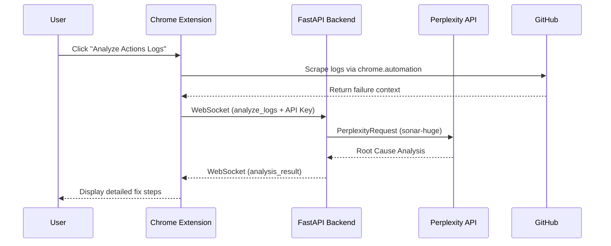

# 🤖 CodeReview Agent

[](https://fastapi.tiangolo.com/)
[](https://www.perplexity.ai/)
[](https://developer.chrome.com/docs/extensions)
[](https://github.com/USER/project-rules-generator)

> **AI-powered code analysis and browser automation agent.** Seamlessly integrate Perplexity's deep reasoning with Chrome's automation API to revolutionize your GitHub workflow.

---

## ✨ Key Features

- 🔍 **Smart Analysis**: Leverage Perplexity's `sonar-huge` model for deep semantic code reviews.
- ⚡ **Real-time Interaction**: Bi-directional streaming via WebSockets for zero-latency feedback.
- 🏗️ **Autonomous Scrape**: Automatically navigate GitHub Actions, scrape logs, and identify root causes.
- 📸 **High-Fidelity Screenshots**: Uses local Puppeteer service for pixel-perfect captures.
- 🛠️ **DevTools Integration**: Captures Network (4xx/5xx) and Console errors for deeper context.
- 🔒 **Secure-First**: API keys are stored in `chrome.storage.sync` and never persisted on the backend.
- 🛠️ **MCP Ready**: Built-in support for Model Context Protocol to connect with your local toolchain.

---

## 🏗️ Architecture



---

## 🚀 Autonomous Workflow (PRG Autopilot)

This project is managed by the **Project Rules Generator (PRG)**, featuring an autonomous execution loop.

| Command | Action |
| :--- | :--- |
| `prg status` | View the real-time project dashboard and progress. |
| `prg next` | Let the agent automatically execute the next pending task. |
| `prg autopilot` | Runs the entire task loop until the project is finished. |
| `prg query` | Smart search for tasks using weighted keyword matching. |

---

## 🧠 Project Skills

The agent is equipped with specialized skills to maintain this codebase:

- 📑 **`analyze-code`**: Deep analysis of FastAPI endpoints and Pydantic validation.
- ♻️ **`refactor-module`**: Structural cleanup following the factory pattern.
- 🧪 **`test-coverage`**: Automated pytest execution with coverage reporting.
- 🛡️ **`fastapi-security`**: Auditing authentication and dependency injection.

---

## 💻 Getting Started

### 1. Backend & Screenshot Service
You need to run both the Python backend and the Node.js screenshot service.

**Terminal 1 (Backend):**
```bash
# Clone & Install
git clone https://github.com/USER/CodeReview-Agent.git
pip install -r requirements.txt

# Start Server
uvicorn src.main:app --host 0.0.0.0 --port 8000 --reload
```

**Terminal 2 (Screenshot Service):**
```bash
# Install Dependencies
npm install

# Start Service
node screenshot-server.js
```
*Listens on `http://localhost:3001`*

### 2. Extension Installation
1. Go to `chrome://extensions/` and enable **Developer mode**.
2. Click **Load unpacked** and select the `/extension` folder.
3. Configure your **Perplexity API Key** in the extension settings.

---

## 🏗 Architecture Details
For a deeper dive into the service hierarchy and data models, refer to [ARCHITECTURE.md](ARCHITECTURE.md).

---
*Built with ❤️ by Antigravity & Amit Production Engineering.*
