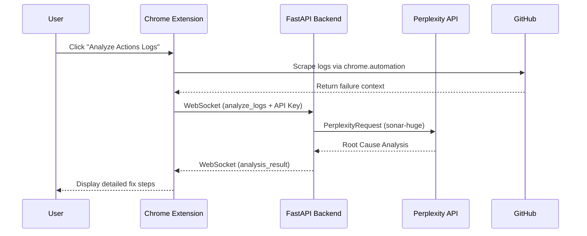

# 🤖 CodeReview Agent

[](https://fastapi.tiangolo.com/)
[](https://www.perplexity.ai/)
[](https://developer.chrome.com/docs/extensions)
[](https://github.com/USER/project-rules-generator)

> **AI-powered code analysis and browser automation agent.** Seamlessly integrate Perplexity's deep reasoning with Chrome's automation API to revolutionize your GitHub workflow.

---

## ✨ Key Features

- 🔍 **Smart Analysis**: Leverage Perplexity's `sonar-huge` model for deep semantic code reviews.
- ⚡ **Real-time Interaction**: Bi-directional streaming via WebSockets for zero-latency feedback.
- 🏗️ **Autonomous Scrape**: Automatically navigate GitHub Actions, scrape logs, and identify root causes.
- 📸 **Native Screenshots**: Captures exactly what you see in your logged-in tab via `chrome.tabs.captureVisibleTab`, analyzed directly by a Groq vision model.
- 🛠️ **DevTools Integration**: Captures Network (4xx/5xx) and Console errors for deeper context.
- 🔒 **Secure-First**: API keys are stored in `chrome.storage.sync` and never persisted on the backend.
- 🛠️ **Real MCP Tool Use**: The code agent runs an actual MCP server (`src/repo_tools`), sandboxed to your repo, giving it `list_files`/`read_file`/`search_code` tools instead of guessing file names from a prompt.
- 🔎 **Live Page Inspection**: The visual agent can call `inspect_element` on your open tab (computed styles, hidden/covered state, size) when the screenshot isn't enough.
- 💸 **Few LLM Calls**: A page analysis is 2 calls plus one per tool turn (tool turns are capped: 2 for the visual agent, 4 for the code agent); the fix plan is written by the code agent, so there's no separate integration call. CI analysis is 1 call. Repeats are served from a file cache, keyed on the repo's git state and the knowledge base's state, so a code change or a new 👍/👎 invalidates it.
- 🧠 **Knowledge Base**: Every analysis is recorded; your 👍/👎 on a fix goes to `MISTAKES.md` ([agent-brain](https://github.com/Amitro1234/agent-brain-cursor) format) and is ingested into a per-project wiki with a link graph (see [Knowledge base](#-knowledge-base)).

---

## 🏗️ Architecture



---

## 🚀 Autonomous Workflow (PRG Autopilot)

This project is managed by the **Project Rules Generator (PRG)**, featuring an autonomous execution loop.

| Command | Action |
| :--- | :--- |
| `prg status` | View the real-time project dashboard and progress. |
| `prg next` | Let the agent automatically execute the next pending task. |
| `prg autopilot` | Runs the entire task loop until the project is finished. |
| `prg query` | Smart search for tasks using weighted keyword matching. |

---

## 🧠 Project Skills

The agent is equipped with specialized skills to maintain this codebase:

- 📑 **`analyze-code`**: Deep analysis of FastAPI endpoints and Pydantic validation.
- ♻️ **`refactor-module`**: Structural cleanup following the factory pattern.
- 🧪 **`test-coverage`**: Automated pytest execution with coverage reporting.
- 🛡️ **`fastapi-security`**: Auditing authentication and dependency injection.

---

## 💻 Getting Started

### 1. Backend
```bash
# Clone & Install
git clone https://github.com/Amitro123/CodeReview-Agent.git
pip install -r requirements.txt

# Start Server
uvicorn src.main:app --host 0.0.0.0 --port 8000 --reload
```

To let the code agent read your code, map projects to local checkouts in `.env` (see `.env.example`).
Keys are a GitHub `owner/repo` or the host of the page you analyze:

```bash
REPO_PATHS=Amitro123/DevLens-AI=/path/to/DevLens-AI,localhost:3000=/path/to/my-app
```

The LLM cache lives in `~/.codereview-agent/cache` (`LLM_CACHE_DIR`); set `LLM_CACHE_TTL_HOURS=0` to disable it.

### 2. Extension Installation
1. Go to `chrome://extensions/` and enable **Developer mode**.
2. Click **Load unpacked** and select the `/extension` folder.
3. Configure your **Perplexity API Key** in the extension settings.

---

## 🧠 Knowledge base

Each project gets a knowledge base that grows from verified runs, following Karpathy's
[LLM wiki](https://gist.github.com/karpathy/442a6bf555914893e9891c11519de94f) pattern:

```
<project>/.codereview-kb/        (or KB_DIR/<project> when the project isn't mapped)
  raw/                           every analysis run + your verdict on it (immutable)
  wiki/components/ issues/ practices/   pages the agent maintains (frontmatter + markdown)
  wiki/index.md  wiki/log.md  wiki/_template.md
  graph/knowledge-graph.json     nodes = pages, edges = related_pages (generated, no LLM)
  MISTAKES.md                    agent-brain inbox (or the project's own, if agent-brain is set up there)
```

The cycle:
1. **Record** (no LLM): every analysis is saved to `raw/` and shown with 👍/👎 buttons.
2. **Verify**: your verdict (plus an optional note on the actual cause) is appended to `MISTAKES.md` in agent-brain format.
3. **Ingest** (1 LLM call, in the background): the run is folded into wiki pages - including "what didn't work" - and the graph is regenerated. Unverified runs are never ingested.
4. **Recall** (no LLM): the next analysis gets a compact map of the wiki plus the best-matching page, and the code agent can call `query_kb` / `get_page` on the KB MCP server for more.

Maintenance, no LLM calls:

```bash
python -m src.kb.cli graph /path/to/project/.codereview-kb
python -m src.kb.cli lint  /path/to/project/.codereview-kb --repo /path/to/project
```

To give Claude Code or Cursor the same knowledge, register the KB server in the project's `.mcp.json`:

```json
{"mcpServers": {"codereview-kb": {
  "command": "python3",
  "args": ["/path/to/CodeReview-Agent/src/kb/kb_server.py"],
  "env": {"MCP_KB_ROOT": "/path/to/project/.codereview-kb"}}}}
```

---

## 🏗 Architecture Details
For a deeper dive into the service hierarchy and data models, refer to [ARCHITECTURE.md](ARCHITECTURE.md).

---
*Built with ❤️ by Antigravity & Amit Production Engineering.*
